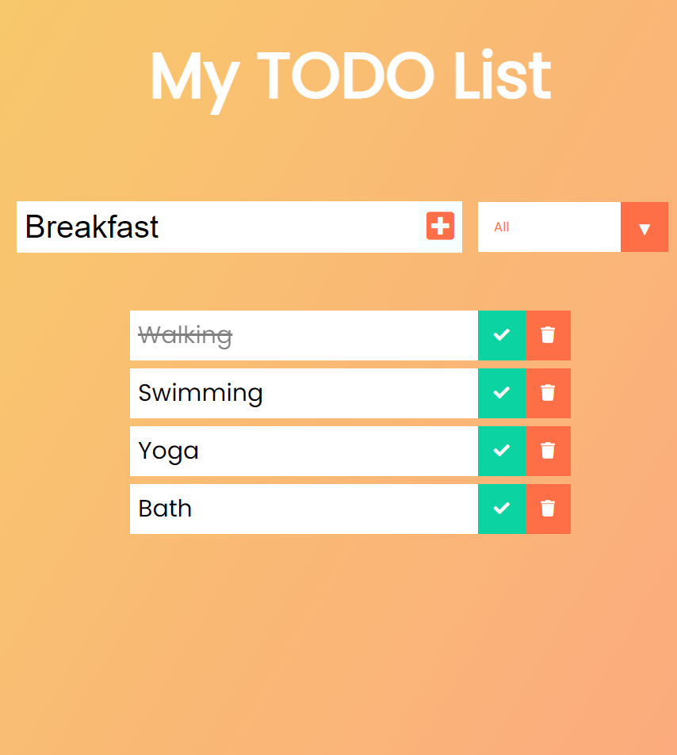

# A Todo List (React) 


`Author:` Padmanabh Belavadi

This is the project based on the idea of `A TODO LIST`.
in this todo list, you can add your daily tasks. and after completion of tasks you can mark them as completed.
u can check that which are tasks are completed and which are remaining to be complete.
`This project completely based on React js`
__all the todo/tasks information is strored in localstorage__

## My Project Looks Like :



### How to Download this project
```

```

 -> Go to Folder
```
cd tubers
```
-> open the terminal run following command

```
npm init
```

-> to start the project

```
npm start
```


## Reach Me Out on

 [Linkedin](https://www.linkedin.com/in/padmanabh-belavadi)


 [GitHub](https://github.com/padmanabh-b)


 [Instagram](https://www.instagram.com/legend_padmanabh/)

 [Findcoder](https://www.findcoder.io/u/padmanabh_b)


